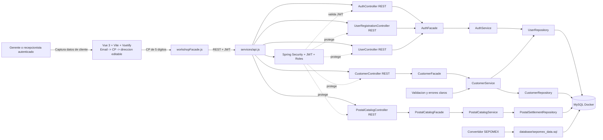

# Diagrama de componentes - Fase 02, registro de clientes y catalogo postal local

## Version interactiva Archify

El diagrama HTML interactivo actualizado con Archify queda en:

`.archify/architecture-taller-fase02-postal-editable-20261004-001500/taller-fase02-postal-editable.html`

Archify valido el artefacto con `validate`, `deliver` y `check`. El `browser-check` quedo omitido porque el equipo no tiene Chrome/Chromium disponible para ese gate automatizado.



## Flujo actual de direccion

| Paso | Campo | Accion del sistema |
| --- | --- | --- |
| 1 | Email | Captura email principal. |
| 2 | Email del trabajo | Captura opcional. |
| 3 | Codigo postal | Al completar 5 digitos consulta MySQL local. |
| 4 | Colonia | Se llena desde SEPOMEX y queda editable. |
| 5 | Municipio | Se llena desde SEPOMEX y queda editable. |
| 6 | Estado | Se llena desde SEPOMEX y queda editable. |
| 7 | Calle | Se captura manualmente. |

## Nota sobre archify

La skill `archify` quedo disponible localmente y se ejecuto directamente con:

```bash
node /home/david/.agents/skills/archify/bin/archify.mjs finalize architecture .archify/architecture-taller-fase02-20260929-000000/candidate.json .archify/architecture-taller-fase02-20260929-000000/taller-fase02.html --quality showcase --json
node /home/david/.agents/skills/archify/bin/archify.mjs finalize architecture .archify/architecture-taller-fase03-20261003-235900/candidate.json .archify/architecture-taller-fase03-20261003-235900/taller-fase03-catalogo-postal.html --quality showcase --json
node /home/david/.agents/skills/archify/bin/archify.mjs finalize architecture .archify/architecture-taller-fase02-postal-editable-20261004-001500/candidate.json .archify/architecture-taller-fase02-postal-editable-20261004-001500/taller-fase02-postal-editable.html --repo-root /home/david/Documentos/ChatGPT/taller --quality showcase --json
```

El HTML de Archify fue generado desde la instalacion local de la skill y queda versionable dentro del proyecto.
