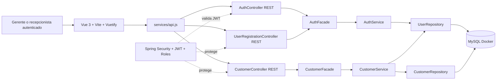

# Diagrama de componentes - Fase 02

## Version interactiva Archify

El diagrama HTML interactivo generado con Archify queda en:

`/.archify/architecture-taller-fase02-20260928-182517/taller-fase02.html`

Archify valido el artefacto con `validate`, `deliver` y `check`. El `browser-check` quedo omitido porque el equipo no tiene Chrome/Chromium disponible para ese gate automatizado.



## Nota sobre archify

La skill `archify` quedo disponible localmente y se ejecuto directamente con:

```bash
node /home/david/.agents/skills/archify/bin/archify.mjs finalize architecture .archify/architecture-taller-fase02-20260928-182517/candidate.json .archify/architecture-taller-fase02-20260928-182517/taller-fase02.html --repo-root /home/david/Documentos/ChatGPT/taller --quality showcase --json
```

El comando solicitado originalmente con `npx` no se pudo ejecutar porque el equipo no tiene `npx` ni `npm` en el PATH, pero el HTML de Archify si fue generado desde la instalacion local de la skill.
