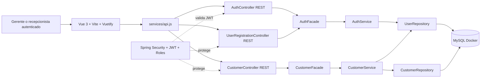

# Diagrama de componentes - Fase 02



## Nota sobre archify

Se intento ejecutar el comando solicitado:

```bash
npx skills add tt-a1i/archify -g
```

El equipo no tiene `npx` ni `npm` disponibles en el PATH, por lo que no fue posible instalar la skill `archify` desde esta maquina. El diagrama queda guardado como artefacto versionable en Markdown con Mermaid.
